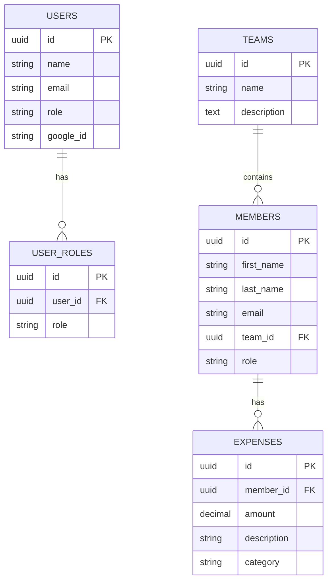

# Arizona Cricket Club - Database Schema Documentation

## 🗄️ **Database Overview**

The Arizona Cricket Club website uses **Supabase (PostgreSQL)** as its database backend. This document provides comprehensive information about all database tables, their relationships, and usage.

## 📊 **Table Summary**

| Table Name | Purpose | Status | Records | RLS | Notes |
|------------|---------|--------|---------|-----|-------|
| `users` | User authentication & profiles | ✅ Active | 1 | ✅ Enabled | Email-based auth |
| `user_roles` | Role-based access control | ✅ Active | 1 | ✅ Enabled | Links to auth.users |
| `teams` | Cricket team information | ⚠️ Empty | 0 | ❌ Blocking | RLS needs fixing |
| `members` | Club member information | ⚠️ Empty | 0 | ❌ Blocking | RLS needs fixing |
| `expenses` | Financial tracking | ❌ Missing | N/A | N/A | Needs creation |

## 🔍 **Detailed Table Schemas**

### **1. Users Table**
**Purpose:** Stores user authentication data and profiles

```sql
CREATE TABLE users (
  id UUID DEFAULT gen_random_uuid() PRIMARY KEY,
  name VARCHAR(255) NOT NULL,
  email VARCHAR(255) UNIQUE NOT NULL,
  emailVerified TIMESTAMP WITH TIME ZONE,
  image VARCHAR(500),
  createdAt TIMESTAMP WITH TIME ZONE DEFAULT NOW(),
  updatedAt TIMESTAMP WITH TIME ZONE DEFAULT NOW(),
  role VARCHAR(50) DEFAULT 'admin',
  google_id VARCHAR(255),
  created_at TIMESTAMP WITH TIME ZONE DEFAULT NOW(),
  updated_at TIMESTAMP WITH TIME ZONE DEFAULT NOW()
);
```

**TypeScript Interface:**
```typescript
interface User {
  id: string                    // UUID primary key
  name: string                  // User's full name
  email: string                 // Email address (unique)
  emailVerified: string | null  // Email verification timestamp
  image: string                 // Profile image URL
  createdAt: string             // Account creation timestamp
  updatedAt: string             // Last update timestamp
  role: string                  // User role (admin, editor, viewer)
  google_id: string             // Google OAuth user ID
  created_at: string            // Database record creation
  updated_at: string            // Database record update
}
```

**Sample Data:**
```json
{
  "id": "a1ff5df5-50c6-44d4-99ba-41b2a52c4dd1",
  "name": "Srini",
  "email": "srinii2005@gmail.com",
  "emailVerified": null,
  "image": "https://example.com/avatar.jpg",
  "createdAt": "2025-09-16T04:35:33.77058+00:00",
  "updatedAt": "2025-09-16T04:35:33.77058+00:00",
  "role": "admin",
  "google_id": "111504681471508856538",
  "created_at": "2025-09-16T05:40:49.476252+00:00",
  "updated_at": "2025-09-16T05:40:49.476252+00:00"
}
```

---

### **2. User Roles Table**
**Purpose:** Manages role-based access control (legacy table)

```sql
CREATE TABLE user_roles (
  id UUID DEFAULT gen_random_uuid() PRIMARY KEY,
  user_id UUID NOT NULL,                    -- References auth.users.id
  role VARCHAR(50) NOT NULL,
  created_at TIMESTAMP WITH TIME ZONE DEFAULT NOW(),
  updated_at TIMESTAMP WITH TIME ZONE DEFAULT NOW(),
  new_user_id UUID                          -- Additional user reference
);
```

**TypeScript Interface:**
```typescript
interface UserRole {
  id: string                    // UUID primary key
  user_id: string               // References auth.users.id
  role: string                  // Role name (admin, editor, viewer)
  created_at: string            // Record creation timestamp
  updated_at: string            // Record update timestamp
  new_user_id: string | null    // Additional user reference
}
```

**Sample Data:**
```json
{
  "id": "bd792eb2-5e15-440c-8a8a-c13ce9629698",
  "user_id": "4943c0da-b1d3-4231-91f0-d53c95bae63c",
  "role": "admin",
  "created_at": "2025-09-16T05:03:04.588963+00:00",
  "updated_at": "2025-09-16T05:03:04.588963+00:00",
  "new_user_id": null
}
```

---

### **3. Teams Table** (Inferred Schema)
**Purpose:** Stores cricket team information

```sql
CREATE TABLE teams (
  id UUID DEFAULT gen_random_uuid() PRIMARY KEY,
  name VARCHAR(100) NOT NULL,
  description TEXT,
  created_at TIMESTAMP WITH TIME ZONE DEFAULT NOW(),
  updated_at TIMESTAMP WITH TIME ZONE DEFAULT NOW()
);
```

**TypeScript Interface:**
```typescript
interface Team {
  id: string                    // UUID primary key
  name: string                  // Team name (Vipers, Rattlers, etc.)
  description?: string          // Team description
  created_at: string            // Record creation timestamp
  updated_at: string            // Record update timestamp
}
```

**Expected Teams:**
- Vipers
- Rattlers  
- Black Mambas
- Cobras

---

### **4. Members Table** (Inferred Schema)
**Purpose:** Stores club member information

```sql
CREATE TABLE members (
  id UUID DEFAULT gen_random_uuid() PRIMARY KEY,
  first_name VARCHAR(100) NOT NULL,
  last_name VARCHAR(100) NOT NULL,
  email VARCHAR(255) UNIQUE NOT NULL,
  phone VARCHAR(20),
  team_id UUID REFERENCES teams(id),
  role VARCHAR(50) DEFAULT 'member',
  status VARCHAR(20) DEFAULT 'active',
  date_of_birth DATE,
  gender VARCHAR(10),
  created_at TIMESTAMP WITH TIME ZONE DEFAULT NOW(),
  updated_at TIMESTAMP WITH TIME ZONE DEFAULT NOW()
);
```

**TypeScript Interface:**
```typescript
interface Member {
  id: string                    // UUID primary key
  first_name: string            // Member's first name
  last_name: string             // Member's last name
  email: string                 // Email address (unique)
  phone?: string                // Phone number
  team_id: string               // Foreign key to teams table
  role: string                  // Member role (member, captain, coach, etc.)
  status?: string               // Member status (active, inactive)
  date_of_birth?: string        // Date of birth
  gender?: string               // Gender (male, female, other)
  created_at: string            // Record creation timestamp
  updated_at: string            // Record update timestamp
  teams?: {                     // Joined data from teams table
    name: string
  }
}
```

**Member Roles:**
- `member` - Regular club member
- `captain` - Team captain
- `vice_captain` - Vice captain
- `coach` - Team coach
- `manager` - Team manager

---

### **5. Expenses Table** (To Be Created)
**Purpose:** Tracks club finances and member dues

```sql
CREATE TABLE expenses (
  id UUID DEFAULT gen_random_uuid() PRIMARY KEY,
  member_id UUID REFERENCES members(id),
  amount DECIMAL(10,2) NOT NULL,
  description TEXT NOT NULL,
  category VARCHAR(100),
  payment_status VARCHAR(20) DEFAULT 'pending',
  due_date DATE,
  paid_date DATE,
  created_at TIMESTAMP WITH TIME ZONE DEFAULT NOW(),
  updated_at TIMESTAMP WITH TIME ZONE DEFAULT NOW()
);
```

**TypeScript Interface:**
```typescript
interface Expense {
  id: string                    // UUID primary key
  member_id: string             // Foreign key to members table
  amount: number                // Expense amount
  description: string           // Expense description
  category?: string             // Expense category
  payment_status: string        // Payment status (pending, paid, overdue)
  due_date?: string             // Due date
  paid_date?: string            // Payment date
  created_at: string            // Record creation timestamp
  updated_at: string            // Record update timestamp
}
```

**Expense Categories:**
- `yearly_dues` - Annual membership fees
- `equipment` - Cricket equipment purchases
- `umpire` - Umpire fees
- `potluck` - Monthly potluck expenses
- `ground_maintenance` - Ground upkeep costs
- `travel` - Travel expenses

---

## 🔗 **Table Relationships**



## 🛡️ **Row Level Security (RLS) Status**

### **Current RLS Configuration:**
- ✅ `users` - RLS enabled, working properly
- ✅ `user_roles` - RLS enabled, working properly  
- ❌ `teams` - RLS enabled, blocking all operations
- ❌ `members` - RLS enabled, blocking all operations
- ❌ `expenses` - Not created yet

### **Required RLS Policies:**

**For Teams Table:**
```sql
-- Allow all authenticated users to read teams
CREATE POLICY "Allow read access to teams" ON teams
  FOR SELECT USING (true);

-- Allow admin users to modify teams
CREATE POLICY "Allow admin to modify teams" ON teams
  FOR ALL USING (auth.jwt() ->> 'role' = 'admin');
```

**For Members Table:**
```sql
-- Allow all authenticated users to read members
CREATE POLICY "Allow read access to members" ON members
  FOR SELECT USING (true);

-- Allow admin users to modify members
CREATE POLICY "Allow admin to modify members" ON members
  FOR ALL USING (auth.jwt() ->> 'role' = 'admin');
```

**For Expenses Table:**
```sql
-- Allow all authenticated users to read expenses
CREATE POLICY "Allow read access to expenses" ON expenses
  FOR SELECT USING (true);

-- Allow admin users to modify expenses
CREATE POLICY "Allow admin to modify expenses" ON expenses
  FOR ALL USING (auth.jwt() ->> 'role' = 'admin');
```

## 🚀 **Setup Commands**

### **1. Create Missing Tables:**
```sql
-- Create expenses table
CREATE TABLE expenses (
  id UUID DEFAULT gen_random_uuid() PRIMARY KEY,
  member_id UUID REFERENCES members(id),
  amount DECIMAL(10,2) NOT NULL,
  description TEXT NOT NULL,
  category VARCHAR(100),
  payment_status VARCHAR(20) DEFAULT 'pending',
  due_date DATE,
  paid_date DATE,
  created_at TIMESTAMP WITH TIME ZONE DEFAULT NOW(),
  updated_at TIMESTAMP WITH TIME ZONE DEFAULT NOW()
);
```

### **2. Insert Sample Data:**
```sql
-- Insert default teams
INSERT INTO teams (name, description) VALUES
('Vipers', 'Arizona Cricket Club Vipers Team'),
('Rattlers', 'Arizona Cricket Club Rattlers Team'),
('Black Mambas', 'Arizona Cricket Club Black Mambas Team'),
('Cobras', 'Arizona Cricket Club Cobras Team');

-- Insert sample members
INSERT INTO members (first_name, last_name, email, phone, team_id, role) VALUES
('John', 'Doe', 'john.doe@example.com', '555-0123', (SELECT id FROM teams WHERE name = 'Vipers'), 'member'),
('Jane', 'Smith', 'jane.smith@example.com', '555-0124', (SELECT id FROM teams WHERE name = 'Rattlers'), 'captain');
```

### **3. Fix RLS Policies:**
```sql
-- Enable RLS on new tables
ALTER TABLE expenses ENABLE ROW LEVEL SECURITY;

-- Create policies (see RLS section above)
```

## 📝 **Usage Notes**

### **Authentication Flow:**
1. User signs in with Google OAuth
2. System checks `users` table by email
3. If found, assigns role from `users.role` field
4. If not found, user gets 'unauthorized' role

### **Data Access Patterns:**
- **Members:** Always joined with teams table for team names
- **Expenses:** Always joined with members table for member info
- **Teams:** Referenced by members for team assignments

### **Common Queries:**
```sql
-- Get all members with team names
SELECT m.*, t.name as team_name
FROM members m
LEFT JOIN teams t ON m.team_id = t.id
ORDER BY m.first_name;

-- Get expenses with member info
SELECT e.*, m.first_name, m.last_name
FROM expenses e
LEFT JOIN members m ON e.member_id = m.id
ORDER BY e.created_at DESC;
```

---

**Last Updated:** September 16, 2025  
**Database:** Supabase (PostgreSQL)  
**Status:** Partially Implemented
